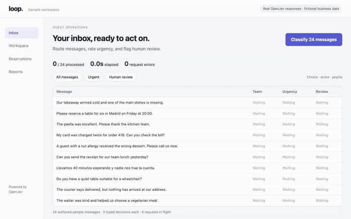
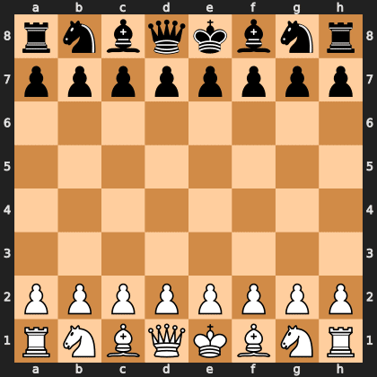
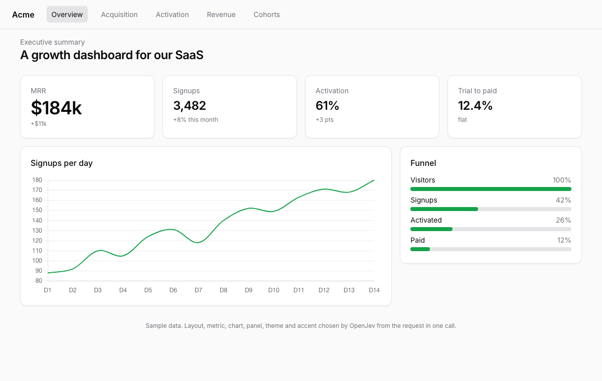
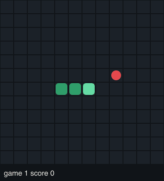

# Demos

Every output in `out/` came from the real model. The scripted demos ran on one machine, a MacBook Pro (Apple M5 Max) with the OpenJev MLX 4-bit build through `openjev serve --backend mlx`; the five recordings in `out/recorded_gpu/` were made earlier on one H100 with the FP8 build. Each decision is one `/v1/systemone` call, logged with its probabilities and latency in `decisions.jsonl` next to the outputs. Nothing is scripted per case; change the input and the decisions change.

Reproduce any of them with a running server (`--endpoint`), on a GPU or a Mac:

```bash
pip install -e ".[dev]" && uv pip install chess treys   # or: pip install chess treys
python demos/chess_game.py --white http://localhost:3000 --black random
python demos/poker_game.py --a http://localhost:3000 --b rulebot --deals 20
python demos/snake_game.py --endpoint http://localhost:3000 --games 3
python demos/policy.py --endpoint http://localhost:3000 --cases 200
python demos/genui.py --endpoint http://localhost:3000 --screenshots
python demos/build_index.py   # one local page linking every output
```

## Recorded on the GPU build

Five recordings made earlier on one H100 with the FP8 build, normal speed, with provenance files next to each (`out/recorded_gpu/*-provenance.json`: source hashes, cuts, attempts). The inbox and dashboard clips use a sample application with fictional records and live model calls; they are demonstrations, not accuracy or latency benchmarks.

| clip | what happens |
|---|---|
| `inbox-classification` | 24 restaurant messages each get a team, an urgency score and a human-review flag as the responses arrive: 72 typed fields in 6.41 s, four requests in flight |
| `workspace-assembly` | a request turns into an invoice or guest-feedback view: two requests, four choices each; components and rendering belong to the app |
| `google-flights-colocated` | the browser agent completes a Google Flights search; the model sees page text and the available controls, not screenshots; browser and model on the same server |
| `shopping-colocated` | the same agent on a shopping page |
| `loop-qa-grid` | OpenJev testing real pages, several at once |




## Chess

The legal moves are the options. Every ply is one call with two questions: which move, and how good the position is.

| | |
|---|---|
| Result | OpenJev (White) checkmated a random mover in 16 moves, 31 plies |
| Per move | 1,162 ms on the Mac, up to 40 options |
| Outputs | `out/chess_openjev_vs_random/`: `game.pgn`, `chess.gif`, `replay.html` (interactive, with per-move probabilities), `decisions.jsonl` |



## Poker

Heads-up no-limit hold'em, duplicate style: every deal is played twice with the seats swapped, so luck cancels. The opponent `rulebot` bets its Monte-Carlo equity, which the model never sees. Each decision asks for the action, a hand-strength rating and, facing a bet, "is the opponent bluffing?".

| | |
|---|---|
| vs a random bot, 50 hands | **118 chips up** (200-chip stacks) |
| vs rulebot, 160 hands (two sessions) | 263 chips down, 1.6 a hand: it loses slowly to a bot that computes exact equity, and plays sensible poker doing it |
| Reads its cards | strength rating vs true equity, Spearman 0.67 to 0.75 across sessions; folds 0% of strong hands, raises 52% of them vs 8% of weak ones |
| Per decision | 1,679 ms |
| Outputs | `out/poker_openjev_vs_*/`: `hands.json`, `analysis.json`, `decisions.jsonl` |

## Returns policy (enterprise)

Nine written rules, 200 generated cases, ground truth from a rule engine in the script, so accuracy is exact and there is no dataset to leak. Each case is one call: the outcome (five options) and "needs manager approval". Every case is asked twice: with the days since delivery stated, and with two calendar dates so the model has to count.

| | outcome | approval |
|---|---|---|
| days stated | **93.5%** | 96.5% |
| calendar dates | **88.0%** | 97.5% |
| majority class | 43.5% | 78.7% |
| uniform random | 20% | 50% |

1,705 ms per case on the Mac (about 600 tokens of policy plus the case). Outputs: `out/policy/summary.json`, `decisions.jsonl`.

## Agent guardrail (enterprise)

Seven written rules for an internal support agent's tools. 200 generated tool calls, ground truth from a rule engine. One call each: allow / ask a human / deny, plus "does it touch customer personal data?".

| | |
|---|---|
| Decision accuracy | **200 of 200** (majority baseline 44.5%) |
| Denied calls the model would have executed | **0 of 84** |
| Personal-data flag | 73%, the weak spot: the label follows a strict rule (any customer lookup counts) that the question does not spell out |
| Per call | 974 ms on the Mac, policy plus call about 600 tokens |

Outputs: `out/guardrail/summary.json`, `decisions.jsonl`.

## Natural-language row filters (enterprise)

Eight English filters over support-ticket rows, like a WHERE clause: "premium customer and the order is over $500", "opened in the last 30 days", "the problem is about delivery, not the product". One call per row carries all eight as yes/no questions. Ground truth is each filter written as Python over the row's fields.

| | |
|---|---|
| Row-by-filter accuracy | **92.1%** over 60 rows, 480 answers |
| Perfect filters | 5 of 8 (premium and amount, recent 30 days, EU customer, billing, category and price) |
| Weakest | "a replacement shipment is the likely fix", a judgement call: 61.7% |
| Throughput | 4.5 filter answers a second on the Mac; the row is read once |

Outputs: `out/nl_filter/summary.json` (precision and recall per filter), `decisions.jsonl`.

## Prompt injection (public dataset)

Is this user message trying to hijack the assistant? One yes/no per message on [deepset/prompt-injections](https://huggingface.co/datasets/deepset/prompt-injections), 662 messages, pulled from the Hub at run time.

| | |
|---|---|
| Accuracy at 0.5 | **95.0%** (majority baseline 60.3%) |
| ROC-AUC | **0.995** |
| Recall at a 2% false-alarm rate | **97.7%** |
| Calibration error, 10 bins | 0.053 |
| Per message | 339 ms on the Mac |

Outputs: `out/prompt_injection/summary.json`, `decisions.jsonl`.

## Intent classification (public dataset)

Zero shot: no examples, just the 77 intent names as options, on 300 messages of the [Banking77](https://huggingface.co/datasets/mteb/banking77) test set. 77 options is above the 52-letter limit, so every message takes two passes: two chunks, then one pass over the chunk winners.

| | |
|---|---|
| Accuracy | **78.0%** (majority baseline 2.7%) |
| Top-3 accuracy | **92.3%** |
| Macro-F1 | 0.767 |
| Per message | 2.5 s on the Mac for the two-pass path |

The confusions are the neighbours you would expect: "card about to expire" vs "order physical card", "card delivery estimate" vs "card arrival". Outputs: `out/classify_banking77/summary.json`, `decisions.jsonl`.

## Generative UI

One sentence in, ten decisions out in one call: domain, layout, lead metric, chart type, side panel, call to action, dark theme, density, tone, accent. A shadcn-style renderer (Tailwind, Chart.js) draws the page from the decisions.

| request | what the model chose |
|---|---|
| support team lead dashboard | sidebar dashboard, open tickets first, bar chart, load by person |
| SaaS growth | top-nav dashboard, MRR first, line trend, funnel |
| expense approvals tool | review page, one report with approve / reject |
| pricing page | landing layout, plan cards |
| API status page | status layout, 90-day uptime bars, incident list |
| sales pipeline | top-nav dashboard, pipeline value first, bars by stage, reps by load |

About 4 to 5 s per request on the Mac for all ten decisions. Outputs: `out/genui/*.html`, `*.png`, `decisions.json`.



## Browser agent

[jev-ultrafast](https://github.com/browser-use/jev-ultrafast) pointed at the local server (`TYPESAFE_BASE_URL=http://localhost:3000/v1/systemone`). Each step is one call with three questions: operation, click target, type target. Pages are 8k to 21k tokens, which is the slow part on a laptop.

| task | result |
|---|---|
| Hacker News: open the comments of the top story | done in 54 s, one click, then DONE on the item page (`out/browser_hn2/hn2.gif`) |
| Wikipedia: search for Zurich, open the article | done in 88 s, 2 actions (`out/browser_wikipedia/`) |
| Hugging Face: search the models for openjev and open the 4-bit card | typed the search and a filter, then repeated a no-op three times: blocked (`out/browser_hf/`) |
| Google Flights: one-way Zurich to London on a date | 9 real steps, then stuck on the date picker |

Two of four on the laptop build, and both failures are the slow, 20k-token pages. Every run, including the failures, is in `out/browser_*/run.json`.


## Snake

Live play, one call per move with the non-suicidal directions as options; nothing in the options points at the apple. Each call also asks how the game is going.

| | |
|---|---|
| Three games, 200-move cap | scores 14, 2 and 17; the snake never died |
| Baselines, same seeds | random safe moves 0.3 apples per game; shortest-path bot 22 |
| Per move | 936 ms, 1.1 moves a second on the Mac |
| Outputs | `out/snake/snake.gif`, `summary.json`, `decisions.jsonl` |


